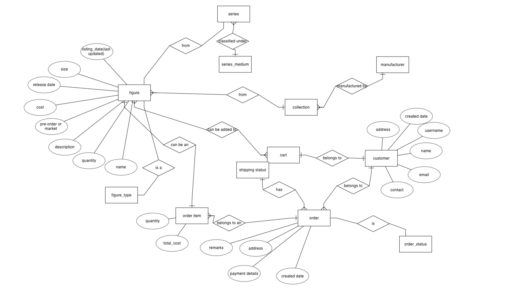
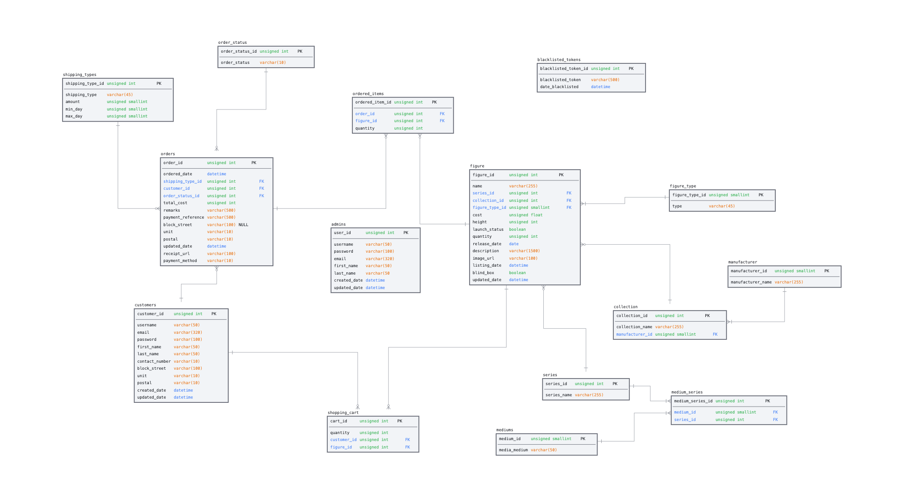

# Summary
This is a restful API and backend web application meant for admins for the [FIGU屋](https://figuya.netlify.app) project.
Please visit the README for FIGU屋 found [here](https://github.com/evelyntys/project-3-figuya) for more details on the project.

[Link to test admin panel](https://etys-figuya-express.herokuapp.com)
    TEST ACCOUNT:
    username: admin
    password: admin123

## Structure of the website

## Database design
1. Entity relationship diagram

2. Logical schema diagram

## Technologies Used
<b >Backend </b>
1. [Express & NodeJS](https://expressjs.com/) as the framework for API endpoints
2. [db-migrate](https://db-migrate.readthedocs.io/en/latest/) for database migration
3. [Bookshelf.js](https://bookshelfjs.org/api.html) for accessing database
4. [cors middleware](https://expressjs.com/en/resources/middleware/cors.html) to enable CORS
5. [dotenv](https://www.npmjs.com/package/dotenv) for .env file containing environment variables
6. [Caolan forms](https://github.com/caolan/forms) for creation and validation of forms
7. [MomentJS](https://momentjs.com/timezone/docs/) for date & datetime display
8. [express-session](https://www.npmjs.com/package/express-session) to manage sessions
9. [express-flash](https://github.com/RGBboy/express-flash) to display lflash messages
10. [jsonwebtoken](https://github.com/auth0/node-jsonwebtoken) for user authentication on front-end
11. [handlebars](https://handlebarsjs.com/) to generate templates
12. [handlebar helpers](https://github.com/helpers/handlebars-helpers)
13. [Cloudinary](https://cloudinary.com/) for image upload
14. [Bootstrap v5.2](https://getbootstrap.com/) for general styling of the website
15. [Bootstrap icons](https://icons.getbootstrap.com/)
16. [Canva color wheel](https://www.canva.com/colors/color-wheel/) to help generate color palettes

## API Endpoints

    BASE API URL: https://etys-figuya-express.herokuapp.com/api

### 1. Products
1.1 Get ALL products
    
    GET /products

1.2 Get FILTERED products
    
    GET /products/search

1.3 Get fields to render for search form

    GET /products/fields

1.3 Get figure by figureId

    GET /products/:figureId

1.4 Get products by seriesId

    GET /products/series/:seriesId

1.5 Get newly listed products (returns newest 6)

    GET /products/newlylisted

### 2. Users
2.1 Registering a new user
    
    POST /users/register

2.2 Login

    POST /users/login

2.3 Get user profile (via JWT)

    GET /users/profile

2.4 Update password

    POST /users/password/update

2.5 Get new access token with existing refresh token

    POST /users/refresh

2.6 Logout

    POST /users/logout

### 3. Cart
3.1 Get cart (via JWT)

    GET /cart

3.2 Add to cart (via JWT)

    GET /cart/:figure_id/add

3.3 Remove from cart (via JWT)

    GET /cart/:figure_id/remove

3.4 Update quantity (via JWT)

    POST /cart/:figure_id/update

### 4. Orders
4.1 Get orders with a specific user_id (via JWT)
    
    GET /orders

## Environment variables

    CLOUDINARY_NAME=
    CLOUDINARY_API_KEY=
    CLOUDINARY_API_SECRET=
    CLOUDINARY_UPLOAD_PRESET=
    DB_DRIVER=
    DB_USER=
    DB_PASSWORD=
    DB_DATABASE=
    DB_HOST=
    SESSION_SECRET_KEY=
    STRIPE_PUBLISHABLE_KEY=
    STRIPE_SECRET_KEY=
    STRIPE_SUCCESS_URL=
    STRIPE_CANCEL_URL=
    STRIPE_ENDPOINT_SECRET=
    TOKEN_SECRET=
    REFRESH_TOKEN_SECRET=